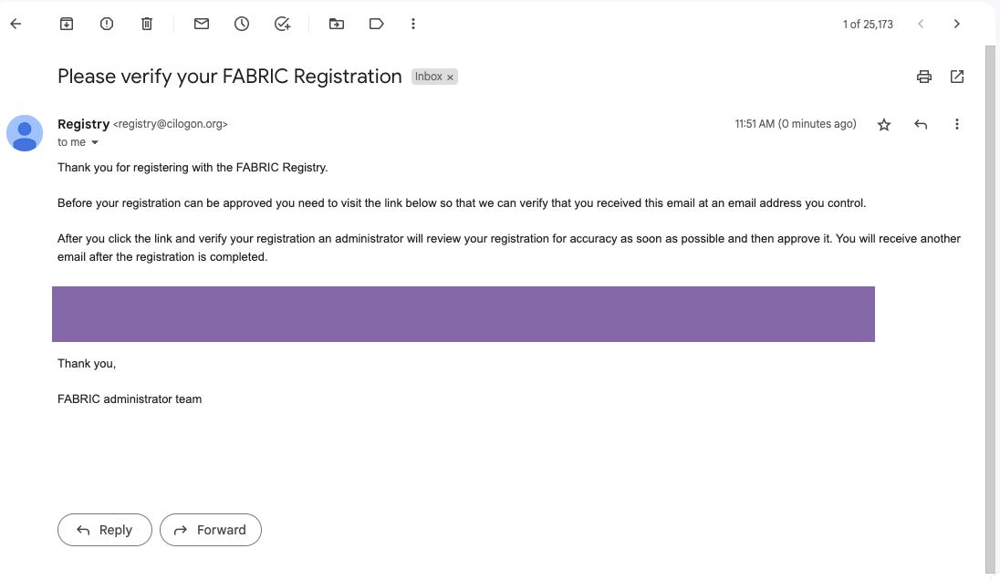
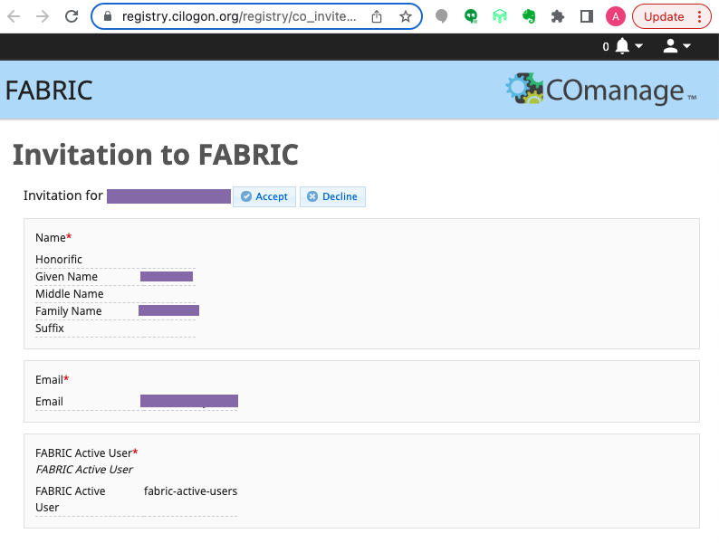

# Hello, FABRIC

In this tutorial, you will learn how to use FABRIC to run experiments in computer networks or cloud computing. It should take you about 60-90 minutes of *active* time to work through this tutorial.

> **Note**
> This process has multiple "human in the loop" approval stages - you'll need to wait for FABRIC staff to approve your account, and then again for your your instructor or research advisor to add you to their project. Be prepared to start the tutorial, wait for this approval, and then continue. 

FABRIC is a "virtual lab" for experiments on networking, cloud computing, and distributed systems. It allows experimenters to set up real (not simulated!) hosts and links at FABRIC sites located around the United States. Experimenters can then log in to the hosts associated with their experiment and install software, run applications, and collect measurements.

Before you can run lab experiments on FABRIC, you will need to set up an account. Once you have completed the steps on this page, you will have an account that you can use for future experiments. This experiment will also demonstrate the process of "reserving" resources on a FABRIC site, logging in to a host on FABRIC, retrieving a file (such as data from an experiment) from a FABRIC host, and deleting your reserved resources to free them for other users.

## Set up your account on FABRIC

Now that you have the software you need, you are ready to set up an account on FABRIC.

### Exercise - Create an account

First, go to [https://portal.fabric-testbed.net/](https://portal.fabric-testbed.net/). If it is your first time visiting this website, click "OK" on the bottom to accept cookies from this website. Then, click the "Sign Up" button in the top right corner.

Read the instructions on the following page, then click "Proceed".

On the following page, use the drop-down menu in the "Select an Identity Provider" box - change the setting from ORCID to your university affiliation. (If your university is not listed there, your instructor or research advisor can provide further instruction on how to log in.)

Once you have made your selection, click "Log On". You will be directed to log in using your university credentials. Then, you'll be prompted to begin setting up your FABRIC account:

Click "Begin" to continue. Next, you will be prompted to select/confirm your institution, and then you will have the opportunity to confirm or modify your personal information (name, etc.). Click "Submit" when you are ready to continue.

Within 10-15 minutes, you will receive an email in order to confirm your email address. The email will include a link (redacted in this screenshot):

Click on the link to continue setting up your account. (This email is automated, so if you don't see it in your inbox or spam folder, you may not have completed your account submission.) 

To continue, you'll need to click "Accept":

### Exercise - Join a project

At this stage, you have an account on FABRIC, but your account is not yet a part of any project. To use FABRIC, you need to be a part of a project that has been approved by the FABRIC staff, under the supervision of a project lead who supervises your use of FABRIC.

If you click on the "Projects" tab in the FABRIC portal dashboard (while logged in to your FABRIC account), you'll see a list of projects that you belong to. For now, you won't be part of any project! You will need to let your instructor or research advisor know that you have created your FABRIC account, and tell them the email address associated with your FABRIC account. Once they have added you to their project, you'll see it listed on that page, and you can continue with the next step.